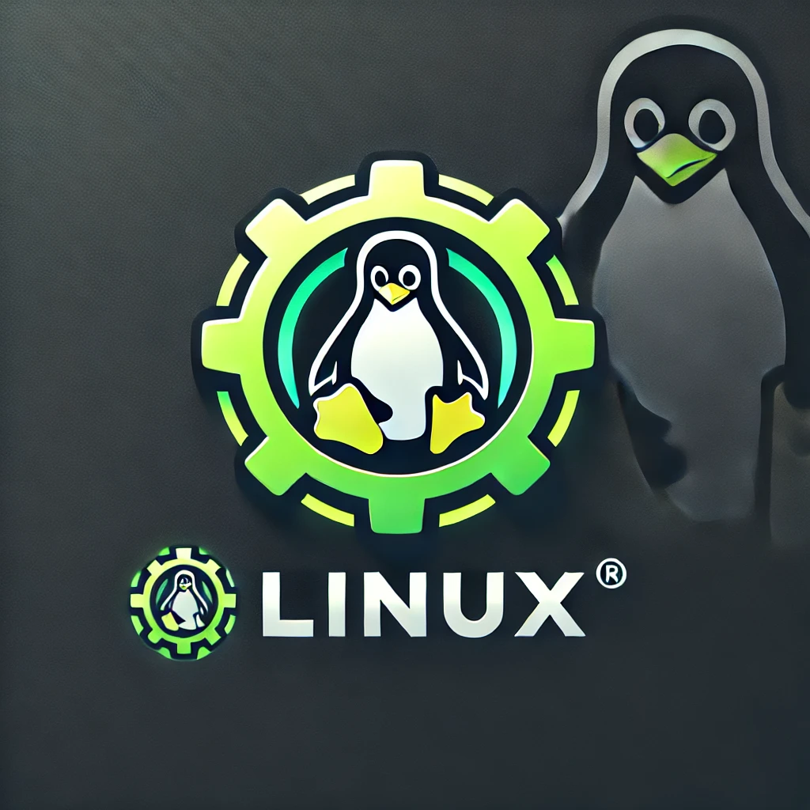

<h1 align="center">Cheat Engine for Linux (experimental)</h1>

Cheat Engine is a development environment focused on modding games and applications for personal use.
Adapted to Linux as my student project.

## Windows / Mac (boring)

The links for all official (Windows / Mac) stuff: 

  * [Website](https://www.cheatengine.org)
  * [Forum](https://forum.cheatengine.org)
  * [Forum (alternate)](https://fearlessrevolution.com/index.php)
  * [Wiki](https://wiki.cheatengine.org/index.php?title=Main_Page)

## Linux (hot)

### Basic Build Instructions

1. Download Lazarus 3.6 for Linux: https://www.lazarus-ide.org/index.php?page=downloads (32 or 64 bit) and install.
2. Clone the project and run `bash build.sh` 
3. Run Lazarus and click on `Project->Open Project`. Select `cheatengine.lpi` from the `Cheat Engine` folder as the project.
4. Click on `Run->Build` or press <kbd>SHIFT+F9</kbd>.
    * you can also click on `Run->Compile many Modes` (tip: select first three compile modes)
    * If you want to run or debug from the IDE on Linux you will need to run Lazarus as root.

5. That's all, enjoy.

## Bug reports

I'll be happy to handle all the failures at kernel at firemail.cc. (well, i'll not not but i'll try :))